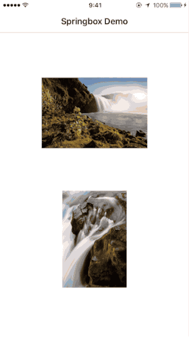

# Springbox

Fullscreen image viewer

## Requirements

- iOS 8.0 or later

## Installation

Use [Carthage](https://github.com/Carthage/Carthage)

## Usage

    func showImageWithSpringbox(image: UIImage) {
      let springboxViewController = SpringboxViewController(image: image)
      springboxViewController.modalPresentationStyle = .OverFullScreen
      springboxViewController.transitioningDelegate = self

      presentViewController(springboxViewController, animated: true, completion: nil)
    }

    // MARK: - UIViewControllerTransitioningDelegate

    private let animatedTransition = SpringboxAnimatedTransition()

    func animationControllerForPresentedController(presented: UIViewController, presentingController presenting: UIViewController, sourceController source: UIViewController) -> UIViewControllerAnimatedTransitioning? {
        animatedTransition.presenting = true
        animatedTransition.image = image
        animatedTransition.sourceRect = imageView.frame

        return animatedTransition
    }

    func animationControllerForDismissedController(dismissed: UIViewController) -> UIViewControllerAnimatedTransitioning? {
        animatedTransition.presenting = false

        return animatedTransition
    }

## License

Springbox is released under the MIT license.  
For more information, see LICENSE file in this repository.
